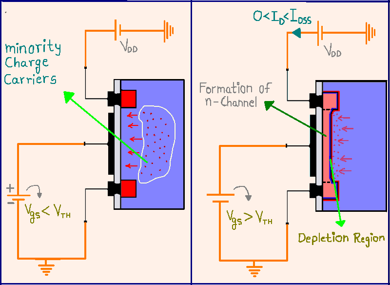

## Procedure

  
**Fig. 1. Gradual channel approximation**

# MOSFET Experiment Procedure

1. **Set the MOSFET Parameters:**
   * Adjust the width (_W_) and length (_L_) of the MOSFET channel using the input fields. For example, set _W_ = 1E-6 m and _L_ = 1E-7 m.
   * Set the mobility (_μ_) value. In this case, use _μ_ = 1400 cm²/V·s.
   * Set the maximum drain-to-source voltage (_VDS,max_) to 10 V.

2. **Configure the Gate-to-Source Voltages (_VG_):**
   * Enter the desired _VG_ values in the input fields. You can set multiple values, for example, from 2 V to 11 V in steps of 1 V.

3. **Set the Material Properties:**
   * Specify the material parameters such as the work function (_φm_), electron affinity (_χs_), and oxide thickness (_tox_), among others.
   * Use typical values like _φm_ = 4.08 eV, _χs_ = 4.05 eV, _tox_ = 3 nm, and _εox_ = 4.
   * Set semiconductor parameters such as _εsemi_ (permittivity of the semiconductor), _NA_ (acceptor doping concentration), and temperature (_T_).

4. **Click on the "Replot" Button:**
   * Press the "Replot" button to generate the output characteristics curves, which plot _ID_ (drain current) versus _VDS_ for each selected _VG_.

5. **Analyze the Output Characteristics:**
   * Observe how the drain current (_ID_) varies with the drain-to-source voltage (_VDS_) for different gate voltages (_VG_).
   * Identify the different operating regions (cutoff, linear, and saturation) for each curve.

6. **Optional - Modify Parameters:**
   * To further explore the MOSFET behavior, modify the parameters (e.g., _W_, _L_, _VG_ values) and click "Replot" again to observe the changes in the output characteristics.
