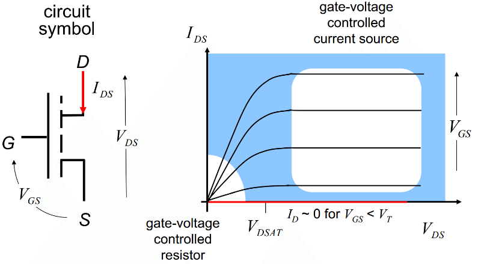

## Theory

 # Introduction

The output characteristics of an n-channel Metal-Oxide-Semiconductor Field-Effect Transistor (MOSFET) describe how the drain current (*I*D) varies as a function of the drain-to-source voltage (*V*DS) for different gate-to-source voltage (*V*G) levels. These characteristics are essential for understanding the behavior of MOSFETs in electronic circuits, especially in applications such as amplification, switching, and digital logic.

 

**Fig. 1. Ideal I-V output characteristics of an nMOS transistor**

## MOSFET Regions of Operation

The output characteristics of an n-channel MOSFET can be divided into three distinct regions of operation, based on the applied voltages:

- **Cutoff Region:** When the gate-to-source voltage (*V*G) is below the threshold voltage (*V*T), there is no conductive channel formed between the drain and source. As a result, the drain current (*I*D) is approximately zero, and the MOSFET remains in the "OFF" state.
  
- **Linear (Ohmic) Region:** When *V*G exceeds *V*T and *V*DS is relatively small, the MOSFET operates in the linear or ohmic region. In this region, the conductive channel is established, and the drain current increases approximately linearly with *V*DS. The MOSFET behaves like a variable resistor, where the channel resistance decreases with an increase in *V*G. The drain current in the linear region is given by the equation:

  *I*D = *K*[( *V*G - *V*T)*V*DS - (*V*DS)2/2],

where *K* is the process transconductance parameter.
  
- **Saturation Region:** As *V*DS increases and becomes larger than (*V*G - *V*T), the MOSFET enters the saturation region. In this region, the drain current becomes nearly constant for a given *V*G and is no longer sensitive to changes in *V*DS. The MOSFET behaves as a current source, and the drain current is primarily controlled by the gate voltage. The expression for *I*D in the saturation region is given by:

  *I*D = (1/2)*K*( *V*G - *V*T)2.

## Threshold Voltage (*V*T)

The threshold voltage (*V*T) is a key parameter in MOSFET operation. It is the minimum gate-to-source voltage required to create a conductive channel between the drain and source. When *V*G is less than *V*T, the MOSFET remains in the cutoff region, and the drain current is nearly zero. For *V*G values above *V*T, the channel becomes conductive, allowing current to flow.

## Significance of the Output Characteristics

The output characteristics provide valuable information about the MOSFET's behavior across different regions of operation. By analyzing the *I*D vs. *V*DS curves for various *V*G values, one can understand the device's switching capabilities, transconductance, and resistance in the linear region. This analysis is crucial for designing MOSFET-based circuits, such as analog amplifiers and digital switches.

     
 
